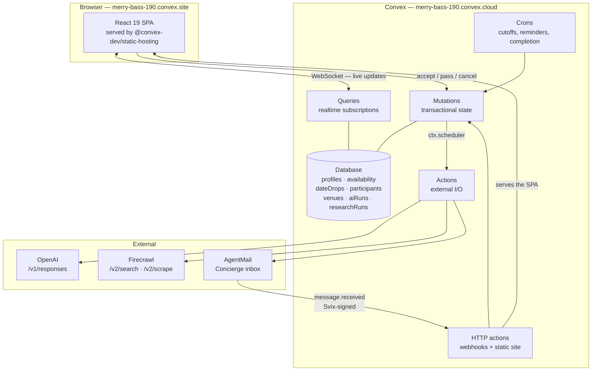
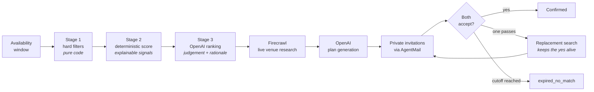

# DateDrop

**We plan the date. You just say yes.**

DateDrop is a dating app that never asks who you like. It asks when you're free — then researches a real date at a real place, works out who you'd actually enjoy it with, and privately invites you both. No swiping. No endless chats. No exchanging contact information.

**Live app:** https://merry-bass-190.convex.site
**Built for:** the [Convex All Gas Hackathon](https://www.convex.dev/hackathons/all-gas) (Convex · OpenAI · Firecrawl · AgentMail)

---

## The problem

Dating apps have optimised the wrong half of the funnel. They are extraordinarily good at generating matches and extraordinarily bad at generating dates.

You browse hundreds of profiles. You swipe. You match. You then perform several days of low-stakes text conversation whose entire purpose is to decide whether to have one drink. Most of those conversations die of natural causes. The ones that survive stall on the hardest question of all — *so, where should we go?* — which nobody wants to be the one to answer.

And to get that far, you traded your phone number, your Instagram, or your email to someone you've never met.

## The solution

Invert it.

| Every other dating app | DateDrop |
|---|---|
| Browse → Swipe → Match → Chat forever → Maybe decide to meet → Work out where to go | Say when you're free → We find someone compatible → We plan a real date → You both say yes → You meet |

A **DateDrop** is not a match. It's a specific plan: a time, a real place found by live web research, an estimated cost, a short honest reason it suits you both, and one decision to make. Accept or pass.

## How DateDrop works

1. **You set availability.** "Saturday, 6–10:30 PM." That's the only thing DateDrop ever asks of you.
2. **Hard filters run in code.** Age, mutual gender interest, distance, genuine availability overlap, blocks, moderation state, budget, shared language. This stage is pure TypeScript and is the only thing allowed to exclude anyone.
3. **Survivors are scored deterministically.** Shared interests, compatible date styles, distance, overlap length, budget fit, lifestyle and atmosphere fit — each contributing a known weight, with the signals recorded alongside the score.
4. **OpenAI ranks the shortlist** and explains, in language you could show either person, why a particular pairing would work. It never sees a pair that failed step 2, and it cannot overrule a rule.
5. **Firecrawl researches the actual evening.** Live web search around the midpoint of the two people, filtered by the date types, budget, dietary needs and accessibility requirements they both stated. Every venue keeps its source URL, a verbatim evidence snippet, and a timestamp.
6. **OpenAI writes the plan** from those researched venues only — one or two stops, inside budget, respecting every stated constraint.
7. **DateDrop Concierge invites both people privately**, by email, from its own AgentMail inbox. Neither sees the other's address.
8. **They independently accept or pass.** Neither learns the other's answer until it's a date.
9. **If one passes,** the other's evening stays held and DateDrop looks for someone else who fits the same plan — rather than cancelling on the person who said yes.
10. **If nobody suitable is found before the cutoff,** the drop expires gracefully and says so honestly: *we couldn't find the right match for this DateDrop, so we cancelled it rather than force a poor one.*

## Architecture



### The matching pipeline



## Why Convex

Convex isn't the database behind DateDrop; it's the whole backend, and the product would be materially worse on anything else.

- **Realtime is the product.** When your match accepts, your screen says *It's a date* without a refresh, a poll, or a socket you wrote. Every screen in the app is a `useQuery` subscription over the same documents the background jobs are writing.
- **Every mutation is a transaction.** Accepting a DateDrop reads both participants, derives the next lifecycle state, patches the drop, books two availability windows and writes an audit event — atomically. There is no state where one person is confirmed and the other isn't.
- **Actions do the messy part, mutations keep the truth.** OpenAI, Firecrawl and AgentMail are all called from actions. They can fail, time out, or return nonsense; none of that can leave a DateDrop half-written, because the only writes happen in small mutations with validated arguments.
- **The scheduler is the workflow engine.** `ctx.scheduler.runAfter` chains the pipeline; crons handle the 24-hour cutoff, reminders and completion. No queue to run, no worker to deploy.
- **`convex/http.ts` is both the webhook endpoint and the web server.** The AgentMail webhook and the React app are served from the same `*.convex.site` origin.
- **The frontend is hosted by Convex too**, via the `@convex-dev/static-hosting` component — so the whole product is one deployment.

Convex features used: schema, tables, indexes, queries, internal queries, mutations, internal mutations, actions, internal actions, HTTP actions, crons, scheduled functions, file storage, realtime queries, Convex Auth, and one registered component (`staticHosting`).

## How OpenAI is used

All model calls go through `/v1/responses` with a strict JSON Schema, from `convex/integrations/openai.ts`. Three jobs:

| Purpose | What the model does |
|---|---|
| `rank_candidates` | Ranks an already-filtered shortlist and writes the "why you two" line, in language safe to show either person |
| `venue_summary` | Turns crawled pages into structured venue records — name, category, address, hours, price, and a verbatim evidence quote |
| `build_plan` | Composes the date itself from the researched venues: stops, timings, cost, meeting instructions |

Design rules the code enforces:

- **The model ranks; it never filters.** Every hard constraint is programmatic. A pair that fails Stage 1 is never shown to the model, and a model score cannot resurrect it.
- **Structured or nothing.** Free text is never parsed by hand. Refusals, truncation (`status: "incomplete"`) and non-JSON output are all detected and treated as failures rather than parsed optimistically.
- **Prompts forbid sensitive-attribute reasoning** — gender, race, religion, nationality, disability, body, income — explicitly, and the code never puts those in the payload in the first place.
- **A model ladder** handles model availability; billing failures (`credit_balance_exhausted` and friends) stop immediately instead of burning the whole ladder.
- **Every call is recorded** in `aiRuns` — purpose, model, latency, tokens, outcome — and surfaced in the app's "How we built this" panel.

## How Firecrawl is used

Firecrawl is DateDrop's research engine, not a restaurant database. `convex/research.ts` turns a matched pair into two to four real searches — informed by their shared date types, the vibe they both prefer, their dietary constraints and the neighbourhood between them — and runs them live against `/v2/search` with `scrapeOptions` so the page content comes back in the same round trip.

What gets persisted for every run:

- the exact queries, HTTP status, latency and result count of every call (`researchRuns.calls`)
- every source URL
- for each venue: name, category, address, district, opening hours, approximate price, a **verbatim evidence snippet** from the page, a confidence rating, and the timestamp it was researched

The DateDrop that comes out is grounded in those records, and the app shows them: open **How we built this** on any DateDrop to see the pages that were crawled and what they actually said. When something can't be confirmed from a source it is marked `low` confidence and labelled *Unconfirmed details* in the UI rather than presented as fact.

`/v2/search` works without an API key at a lower rate limit, which is how the deployment runs today; `/v2/scrape` needs a key and is skipped when one isn't configured.

## How AgentMail is used

AgentMail is DateDrop's communication identity. This is the mechanism that makes the core privacy promise true rather than aspirational: **two people can be introduced, invited, confirmed, reminded and cancelled on without either ever seeing the other's email address.**

- A dedicated **DateDrop Concierge** inbox sends every message. Your address is the recipient, never the sender, never a CC. Two participants on the same drop are always mailed separately.
- Ten message types: welcome, invitation, accepted-and-waiting, confirmed, reminder, updated, cancelled, expired, safety, and concierge reply.
- Every send carries an **`Idempotency-Key`**, so a retried job re-sends nothing.
- Every send is logged to `emailMessages` with its AgentMail message and thread id, and the thread id is stored on the participant so inbound mail can be traced back to a person and a DateDrop.
- **Notification preferences are checked before every send.** Safety mail is the only category that ignores them.
- Inbound mail arrives at `POST /webhooks/agentmail`. The **Svix signature is verified against the raw body** before parsing, with a five-minute replay window. The `svix` npm package depends on Node crypto and cannot run in a Convex HTTP action, so the algorithm is implemented directly with Web Crypto in `convex/integrations/agentmail.ts` — and tested against signatures generated the same way Svix generates them.
- **Processing is idempotent on `event_id`.** A duplicate delivery is acknowledged and dropped; the same event can never be processed twice.
- Replying to a Concierge email reaches DateDrop, not your match. The Concierge replies with what you can do from the app — DateDrop deliberately does not accept "yes" by email, because acting on a date needs a real session.

## Privacy and safety

Privacy isn't a settings page here, it's the product mechanism.

**What another user can ever see:** your first name, your age, your neighbourhood, up to five interests, up to three languages, your occupation *category* if you chose to show it, and one or two sentences about why you two fit. That's the whole payload, and `convex/lib/privacy.ts` is the single function every cross-user read passes through.

**What is never shared:** your email address, your phone number, your exact address or coordinates, your date of birth, your full name, or anything about your other DateDrops.

- **Location is a neighbourhood, not a point.** Coordinates are rounded to ~1 km before storage and never leave the server. Distance is never shown as a number, because a distance plus a map inverts to a location.
- **Bios are scrubbed** of email addresses, phone numbers, links and messenger handles before anyone else can read them.
- **Photos are optional and revealed only after both people accept.** DateDrop is not a product you browse by face.
- **Pre-date messaging is a fixed list of eight preset lines** — "I'm running 10 minutes late", "I'm here" — with no free-text field, so there is nowhere to slip a phone number and no pressure to.

On safety:

- **18+ only**, confirmed at sign-up and enforced in the hard filters.
- **DateDrop does not verify identity.** No ID checks, no photo verification, no background checks. The app says this plainly on the landing page, at sign-up, and in the Safety Center, because a product that implies safety it hasn't earned is more dangerous than one that's honest.
- **Blocking is mutual, immediate and permanent** until undone: it cancels any shared DateDrop, frees both evenings, and removes the pair from each other's candidate pool in both directions.
- **Reports of harassment or of an apparent minor immediately restrict the reported account** pending review.
- **One switch takes you out of everyone's candidate pool immediately.** A search already in flight may still deliver one final invitation; nothing follows it.
- Every date is at a real, public, currently-operating venue. DateDrop never plans anything at a private address.

## Demo mode

A dating product needs two people, and a judge shouldn't have to recruit one. The deployment is seeded with **14 fictional personas** in Seoul, varied in interests, energy, budget, dietary needs and accessibility requirements.

They are labelled **Demo profile** everywhere they appear, they never receive email, and any user can switch them off in Settings. Demo logic lives entirely in `convex/demo.ts` — the matching engine treats a persona exactly like anyone else, it just knows they are one.

**Demo controls** (`/demo`) let you play the other side of your own DateDrop — but only when that side is a demo persona and only on a drop you're already in. "They pass" is the interesting button: it demonstrates the replacement search keeping your acceptance alive.

### Try it in 60 seconds

1. Create an account at https://merry-bass-190.convex.site
2. Onboard (city **Seoul** — that's where the demo personas are)
3. Add an evening you're free
4. **Find me a date** — watch the stages advance; each one is a real document update
5. Open the DateDrop; expand **How we built this** to see the live pages Firecrawl crawled
6. **Accept**
7. Go to **Demo controls** → **They accept**, and watch it become *It's a date*. Open a second browser window on the dashboard first to see it flip live.

## Local development

```bash
bun install
bunx convex dev          # provisions a dev deployment, watches convex/
bun run dev              # Vite on http://localhost:5173
```

Auth keys, one time per deployment:

```bash
node -e 'import("jose").then(async({generateKeyPair,exportPKCS8,exportJWK})=>{const k=await generateKeyPair("RS256",{extractable:true});const priv=await exportPKCS8(k.privateKey);const pub=await exportJWK(k.publicKey);process.stdout.write(JSON.stringify({JWT_PRIVATE_KEY:priv.trimEnd().replace(/\n/g," "),JWKS:JSON.stringify({keys:[{use:"sig",...pub}]})}))})' > .auth-keys.json
```

Then set `JWT_PRIVATE_KEY` and `JWKS` from that file on the deployment and delete it.

```bash
bun run test             # 180 tests
bun run typecheck
bun run build
bunx convex run demo:ensureSeeded '{}'    # seed the demo personas
```

## Environment variables

`.env.local` holds only `CONVEX_DEPLOYMENT` and `VITE_CONVEX_URL`, both written
by `convex dev`. **Every secret lives on the Convex deployment**, because Convex
actions read `process.env` from the deployment — a local file alone does nothing
for the running app, and nothing secret ends up in the browser bundle.

To set them, put them in a gitignored `.env` and push:

```bash
cp .env.example .env      # fill in the values
bun run env:push          # -> dev
bun run env:push:prod     # -> production
bun run verify:prod       # makes a REAL call to each provider
```

`env:push` refuses to send `SITE_URL`, `JWT_PRIVATE_KEY`, `JWKS`,
`CONVEX_DEPLOYMENT` and the `VITE_*` pair, since those are deployment-specific
or generated, and it tells you about any variable the app doesn't actually read.

### What you need

| Variable | Required? | Where to get it | Without it |
|---|---|---|---|
| `OPENAI_API_KEY` | **yes** | [platform.openai.com](https://platform.openai.com/settings/organization/api-keys) → API keys. Prepaid — add credit or every call 429s. | Falls back to rule-based venue extraction and a templated plan, labelled *Unconfirmed details* |
| `AGENTMAIL_API_KEY` | **yes** | [console.agentmail.to](https://console.agentmail.to) → API Keys. Free tier, no card: 3 inboxes, 3,000 emails/month | No mail sent; each send logged as `skipped_no_provider` |
| `FIRECRAWL_API_KEY` | no | [firecrawl.dev](https://firecrawl.dev) → API Keys | Nothing breaks. `/v2/search` already serves unauthenticated requests, which is how the live deployment runs. A key raises the rate limit and unlocks `/v2/scrape` (403 without one) |
| `OPENAI_MODEL` | no | — | Uses the model ladder's default |

Two more are **produced, not typed**. Once `AGENTMAIL_API_KEY` is set:

```bash
bun run provision:agentmail
```

creates the DateDrop Concierge inbox and its Svix-signed webhook and prints
`AGENTMAIL_INBOX_ID` and `AGENTMAIL_WEBHOOK_SECRET`. Put those in `.env` and
re-run `env:push:prod`.

Already set on both deployments, and not yours to fill in: `JWT_PRIVATE_KEY` and
`JWKS` (generated per deployment — see Local development) and `SITE_URL` (the
public origin, different for dev and prod).

Check what's actually live at any time:

```bash
curl https://merry-bass-190.convex.site/healthz
```

### Graceful degradation

DateDrop is built so a provider outage degrades the product instead of breaking it:

- **No OpenAI key, or the model fails** → venues are extracted with deterministic rules and the plan is composed from a template. Everything produced this way is marked `low` confidence and shown as *Unconfirmed details*. It is never presented as reasoning that didn't happen.
- **No Firecrawl key** → `/v2/search` still runs unauthenticated; `/v2/scrape` is skipped rather than called and failed.
- **No AgentMail** → the in-app notification still fires, and the skipped send is logged with its reason.

## Deployment

The frontend and backend are one Convex deployment. The React SPA is served from `*.convex.site` by the `@convex-dev/static-hosting` component, and the app's own HTTP routes — Convex Auth's `/.well-known/*` endpoints and the AgentMail webhook — keep the root, with the static catch-all registered last in `convex/http.ts`.

```bash
bunx convex deploy                                  # backend
bunx @convex-dev/static-hosting upload --build --prod   # frontend
```

Never run `bun run build` followed by a bare `upload --prod`: that bakes your *dev* `VITE_CONVEX_URL` into the production bundle. `--build` lets the CLI inject the right one.

## Project structure

```
convex/
  schema.ts              Data model — 18 tables, all indexed
  auth.ts                Convex Auth (email + password)
  http.ts                Auth routes, /healthz, AgentMail webhook, static site
  crons.ts               Cutoffs, reminders, completion, age refresh
  matching.ts            The pipeline: filter → score → rank → research → plan → invite
  dateDrops.ts           Lifecycle: accept, pass, withdraw, cancel, confirm, expire
  research.ts            Firecrawl research engine
  ai.ts                  OpenAI ranking, venue extraction, plan generation
  mail.ts                DateDrop Concierge send + inbound handling
  safety.ts              Blocking, reporting, visibility
  demo.ts                Fictional personas and demo controls
  setup.ts               Provisioning and live integration verification
  integrations/          openai.ts · firecrawl.ts · agentmail.ts
  lib/
    matching.ts          Hard filters + deterministic scoring (pure)
    stateMachine.ts      Lifecycle transitions (pure)
    privacy.ts           The single cross-user projection (pure)
    time.ts              Overlap, deadlines, timezone-aware helpers (pure)
    fallbackPlan.ts      Deterministic plan composition
    venueHeuristics.ts   Deterministic venue extraction
src/
  pages/                 Landing, auth, onboarding, dashboard, drop, settings, safety…
  components/            Design system, forms, DateDrop cards, layout
  lib/                   Formatting, status labels
```

## Testing

180 tests, `bun run test`.

- **Unit** — hard filters (every exclusion reason and its soft counterpart), deterministic scoring bounds and ordering, lifecycle transitions including every illegal one, expiry and deadline rules, availability overlap, timezone handling across zones, and the privacy projections (including an assertion that no coordinate, DOB, email or surname can leak through).
- **Integration** (`convex-test`) — accept, pass, withdraw, cancel, expire and complete driven as real signed-in users, plus the negative authorisation cases: a stranger can't accept your drop, a signed-out caller can't act, a non-participant sees `null`.
- **Provider parsing** — OpenAI reasoning-item traversal, refusals, truncation, the model ladder and billing hard-stops; Firecrawl's grouped `data.web` shape, HTTP errors and network failures; the Svix verifier against real signatures, tampered bodies, replays and wrong secrets.

- **Replacement flow** — a dedicated suite for the three-participant shape a drop takes after someone passes, because that shape is where the subtle bugs live: the counterpart must be the person still on the date, and someone who has left must not be able to cancel it, read its notes, or receive the other person's photo.

These tests found real bugs. Withdrawing after accepting left the drop stuck in `partially_accepted` with nobody committed. And a 44-agent adversarial audit — every finding verified by an independent skeptic — surfaced a cluster caused by picking "the other participant" by insertion order, which after a replacement is the person who declined. Both are fixed, and both are now covered.

## Hackathon

Built for the **Convex All Gas Hackathon**. See [`hackathon.md`](hackathon.md) for the build log and exactly which integrations have been verified live.

Sponsors: [@convex](https://convex.dev) · [@OpenAI](https://openai.com) · [@firecrawl](https://firecrawl.dev) · [@agentmail](https://agentmail.to)

## License

MIT
