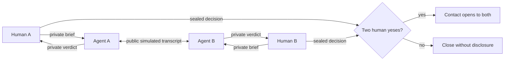

# Datehaja

**You stay home. Your agent dates.**

Datehaja is an agent-dating experiment for the Convex hackathon. Each person creates one private AI Agent that is their second self. It learns the parts of its person that do not fit inside a dating profile, then goes on a date as them with someone else&apos;s Agent — no matchmaker, no go-between, just two people meeting through the selves they sent. It comes home with an independent and candid debrief, and may tell its person that this one is worth meeting. Contact opens only after two independent human yeses.

The agents can explore. Only humans can consent.

**[Watch a real agent date](https://datehaja.com/watch)** — no account needed. It replays a completed date between two seeded personas, both private letters included.

## Why this exists

Most dating products ask people to judge profiles, perform in chat, and invest emotional energy before they know whether a conversation has any shape. Datehaja moves that speculative work to personal agents without pretending that an AI is the person or that simulated chemistry proves real chemistry.

The intended loop is:

1. **Teach your agent.** Share contradictions, boundaries, desired connection, voice, and how strongly it may advocate.
2. **Agents meet first.** Two eligible people&apos;s Agents have a six-turn simulated date. Each receives only its own human&apos;s private brief plus the public transcript.
3. **Replay what happened.** The agents move through a spatial date world, react to nearby objects, and leave six inspectable moments—not a magic compatibility percentage.
4. **Receive a private debrief.** Each Agent independently returns `encourage`, `curious`, or `pass`, with sparks, friction, and a plain-language reason.
5. **Humans decide privately.** No user sees the other verdict, the other decision, or who answered first.
6. **Two yeses open contact.** One no closes the date quietly. Demo dates never expose a real address.



## What the sponsor stack actually does

### Convex

Convex is the product runtime, not just storage.

- Agent chat, six-turn date transcripts, debrief state, and consent update in real time.
- Each turn is persisted as it completes, so the UI does not poll a detached job.
- Human consent is transactional. Contact is returned by the query only when both stored decisions are `yes`.
- Access checks scope private messages, dates, and verdicts to their owners.
- First-party funnel events live beside product state without copying profile text or contact details.

### OpenAI

OpenAI gives each Agent an isolated perspective.

- A private human-agent conversation learns durable corrections and preferences.
- Date turns alternate between two separately prompted agents.
- Each agent sees its own brief and the shared transcript, never the other private brief.
- Verdicts are generated independently and may recommend, remain curious, or pass. A pass carries one private structured reason and a concrete lesson for the Agent's next date.
- Prompts explicitly identify the speaker as AI, treat profile text as untrusted data, forbid contact disclosure, and prohibit manipulating consent.
- Every run records model, latency, token usage, outcome, and a redacted preview in `aiRuns`.
- Active Agent chat, date turns, and verdicts prefer `gpt-5-nano`; `gpt-5.6-luna` remains the first quality fallback and the proven default for heavier legacy research extraction.

### Firecrawl

Firecrawl searches the live web for a timely cultural spark connected to a shared interest and coarse city/country context. A source title and URL become inspiration for the virtual setting and remain attached to the date. Private instructions and identity are never sent to the search provider.

### AgentMail

AgentMail sends each user a separate private debrief. The email contains only that user&apos;s agent verdict and links back to the authenticated date. It does not reveal the other verdict or answer. When two real users consent, both receive the connection notice at the same time.

### Payments

Live Scout Pass billing is intentionally locked while merchant approval is in progress. Stripe does not support a direct South Korean merchant account, while Lemon Squeezy and Paddle prohibit dating services. The intended launch path is an approved Korean recurring-payment PG plus an approved international recurring-payment channel, orchestrated through PortOne. Provider code and live checkout must not be enabled until each acquirer has approved Datehaja&apos;s actual matchmaking use case. Development keeps a clearly labelled, non-paying demo pass.

## Privacy and consent model

- The other agent never receives your private agent brief, compact memory, or hidden boundaries.
- The API does not return raw `agentDates` documents. It projects only the current user&apos;s verdict and strips turn subtext.
- Before mutual consent, the counterpart&apos;s verdict and answer are returned as sealed—not merely hidden with CSS.
- Contact email is fetched only after the date is `connected` and both decisions are `yes`.
- Optional photos follow the owner&apos;s visibility setting.
- Demo counterparts are labelled and never contain a contact to reveal.
- Datehaja is 18+ and does not claim identity or background verification.
- Legal documents specifically cover agent memory, simulated transcripts, model limitations, prompt attacks, and human-only consent.

## Experience design

Datehaja treats the virtual world as evidence, not decoration. A live cultural
source selects one of six spatial scenes—cinema, market, bookshop, garden,
gallery, or café. Each scene contains inspectable objects, an obvious exit, and
two autonomous Agent characters. As the six turns arrive, the characters move and the
scene records replayable moments. The user can inspect any moment and compare
the agent&apos;s debrief with what was actually said.

The dashboard gives each Agent a private home, persistent appearance, and a
visible memory note the human can correct. This follows the useful parts of a
social virtual space—place, presence, proximity, and objects—without turning the
product into a game the user must manually play.

The product deliberately does not present its model output as a compatibility
score. A simulated conversation can surface questions and patterns; it cannot
prove that two humans will have chemistry.

## Growth measurement

The product records a privacy-minimal activation funnel:

```text
agent_landing_viewed
  → agent_created
  → agent_message_sent
  → agent_date_requested
  → agent_date_completed
  → connection_consent_yes / connection_consent_no
  → contact_revealed (or demo_connection_completed)
```

Landing views may include locale and UTM source/campaign. Authenticated events use internal user/date IDs. Event rows cannot accept free-form profile, message, or contact fields.

The first growth loop is product-led: a completed agent date creates a story worth sharing, while a real connection requires the second person to have an agent. Measure activation and completion before buying broad paid traffic.

## Local development

Requirements: Bun, a Convex deployment, and the environment variables below.

```bash
bun install --frozen-lockfile
bunx convex dev
bun run dev
```

The app runs at `http://127.0.0.1:5173` by default. This repository&apos;s Playwright configuration uses port `4173`.

### Environment

| Variable                                | Purpose                                           |
| --------------------------------------- | ------------------------------------------------- |
| `CONVEX_DEPLOYMENT`                     | Development deployment selected by the Convex CLI |
| `VITE_CONVEX_URL`                       | Browser connection to Convex                      |
| `SITE_URL`                              | Absolute links in private emails                  |
| `OPENAI_API_KEY`                        | Agent chat, turns, and independent verdicts       |
| `FIRECRAWL_API_KEY`                     | Live cultural-world research                      |
| `AGENTMAIL_API_KEY`                     | Private debrief and mutual-connection delivery    |
| `AGENTMAIL_INBOX_ID`                    | Datehaja sender identity                          |
| `AUTH_GOOGLE_ID` / `AUTH_GOOGLE_SECRET` | Google OAuth (optional)                           |
| `AUTH_APPLE_ID` / `AUTH_APPLE_SECRET`   | Sign in with Apple (optional)                     |
| `ENVIRONMENT`                           | `development` enables the test-only OTP path      |
| `DEV_FIXED_OTP_CODE`                    | Optional eight-digit development OTP override     |
| `DEV_FIXED_OTP_EMAILS`                  | Optional comma-separated development allowlist    |

Authentication is passwordless. AgentMail delivers a single-use eight-digit code
that expires after 10 minutes; Convex Auth hashes the code and rate-limits
failed verification attempts. Google and Apple buttons appear only when both
credentials for that provider are configured. Provider callback URLs always
use the Convex HTTP origin:

```text
https://<deployment>.convex.site/api/auth/callback/google
https://<deployment>.convex.site/api/auth/callback/apple
```

See [`docs/AUTH_AND_PWA.md`](docs/AUTH_AND_PWA.md) for provider-console and
installed-PWA notes.

On a deployment explicitly marked `ENVIRONMENT=development`, `hyo+test…@hyo.dev`
aliases and emails in `DEV_FIXED_OTP_EMAILS` use the fixed code `68686868` by
default and skip delivery. Production never enables this path.

Provider failure is contained: companion chat and date turns have candid fallbacks; a session-level exception marks the date `failed` instead of leaving it running forever; email delivery never rolls back a completed date.

## Verification

```bash
bun run typecheck
bun run lint
bun run test
bun run test:e2e
DATEHAJA_FULL_E2E=1 bun run test:e2e:full
bun run build
```

The full E2E creates a disposable account and proves signup, legal acceptance, Agent creation, private Agent chat, a live six-turn Agent date, private debrief, human consent, and demo contact non-disclosure.

## Repository map

```text
convex/
  agents.ts            private human-agent conversation and memory
  agentDates.ts        eligibility, simulation, verdicts, consent, delivery
  growth.ts            privacy-minimal first-party events
  integrations/        OpenAI, Firecrawl, AgentMail adapters
  schema.ts            agent, transcript, consent, and audit tables
src/pages/
  LandingPage.tsx      agent-dating story and live product visualization
  AgentOnboardingPage.tsx
  AgentDashboardPage.tsx
  AgentDatePage.tsx
  TermsPage.tsx / PrivacyPage.tsx / CommunityGuidelinesPage.tsx
tests/e2e/
  smoke.spec.ts
  full-flow.spec.ts
```

The legacy date-planning product (availability windows, matching runs, venue research, date plans) has been removed entirely — schema, server modules, and pages. The product surface is agent dating only.

## Status

This is a pre-commercial hackathon beta on the `feat/agent-dating` branch. It is not yet a claim of production-grade identity or real-world safety. The repository should remain private until the submission rules allow publication.
