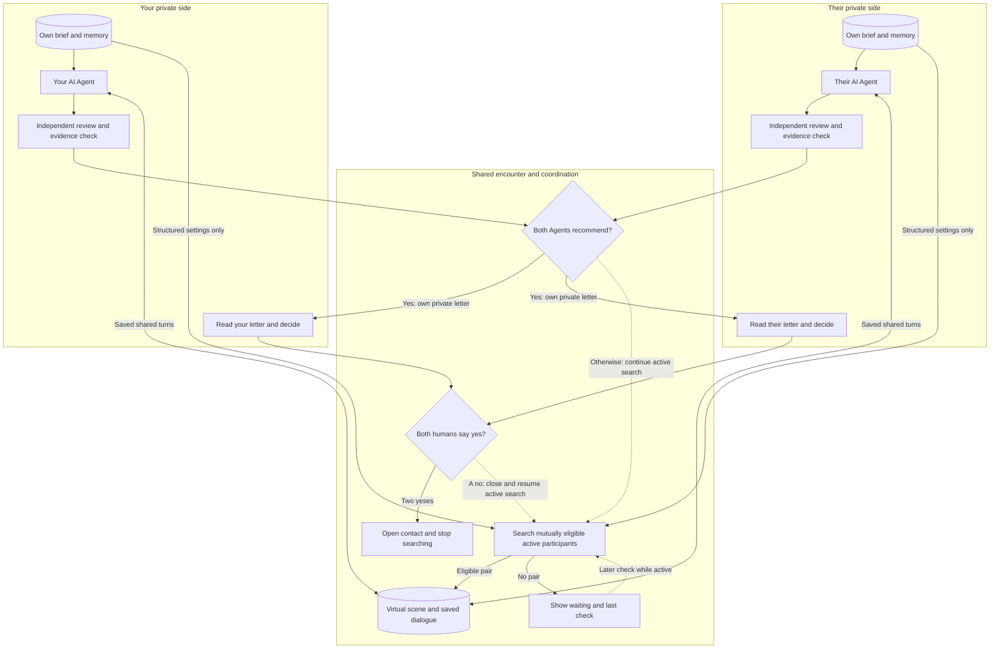
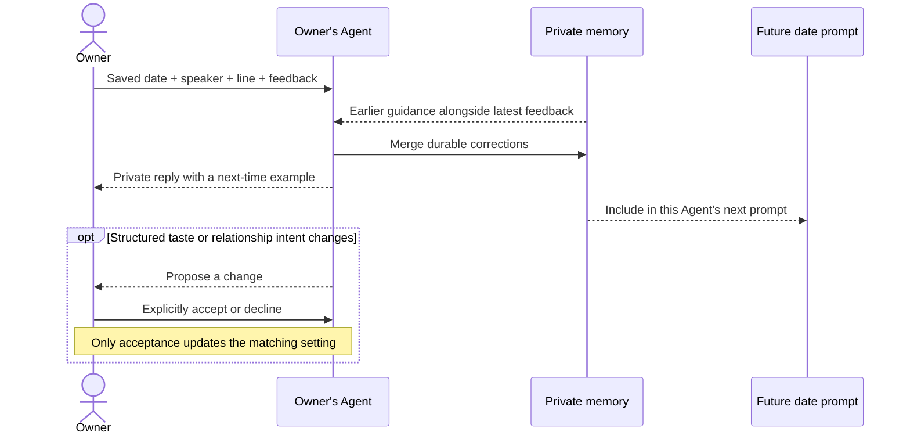

# How it works diagrams

Implemented on 2026-09-09 in the landing page's `#how-it-works` section.
Following the owner's clarification, the primary view is now a simple learning
loop: create an Agent, let it date, hear what happened, and give feedback.
Three explicitly illustrative examples show voice correction, partner
preferences, and positive reactions carrying into a future encounter.
The detailed diagrams below are collapsed by default and only loaded when
the visitor opens the optional explanation. The primary view contains no
input/output panels or technical gates.
The same component is available at `/how-it-works` without authentication,
including for signed-in owners whose home route opens their dashboard.
The coaching preview links to this explanation and the explanation links back
to the explicitly fictional coaching record.

The interactive diagram is explanatory, not a live search visualization.
Korean and English copy is provided; other locales currently use English.
No backend behavior was changed for this feature.

## System and data flow

One pending human choice keeps contact sealed. The diagram's selected-step
panel explains pauses, current goal rechecks, email preferences, early endings,
review repair/failure, private projections, and the difference between a
proposed scene activity and a completed one. A review is not a correctness
guarantee.

## Feedback sequence

Feedback about self refines the owner's voice. Feedback about a counterpart
records the owner's reaction; it does not rewrite that counterpart. Past turns
remain unchanged. Pending feedback blocks the start of another encounter.

## Code references and validation

- UI: `src/components/agent/AgentLearningLoop.tsx` and
  `AgentSystemDiagram.tsx`, their CSS and copy modules;
  `src/pages/HowItWorksPage.tsx`, `LandingPage.tsx`, and `App.tsx`.
- Search: `scouting.advance`, `agentDates.createDateRequest`.
- Conversation: `agentDates.runTurn`, `buildDateTurnRequest`.
- Interpretation: `dateReview`, `dateActivityReview`, `agentDates.finalize`.
- Delivery and consent: `deliverDebriefs`, `agentDates.consent`,
  `deliverConnection`.
- Coaching: `agents.send`, `reply`, `storeReply`.
- Build and lint passed; existing suite: 351 tests in 39 files passed.
- Browser checks: Korean/English; light/dark themes; 320, 390, 1024, and
  1360 px widths; no observed horizontal overflow; visible diagram buttons
  at least 44 px high; feedback view, mobile inline explanation, tablet
  navigation to the detail, and public explanation route exercised.
- Simplified view: four steps, three feedback examples, optional diagram
  open/close, unique IDs when expanded, and avatar containment verified.
  Actual dashboard conversation starters now invite voice corrections,
  partner preferences, and positive date feedback in plain language.
- Static frontend published only to dev `adorable-boar-359`; production
  `merry-bass-190` was not changed.
